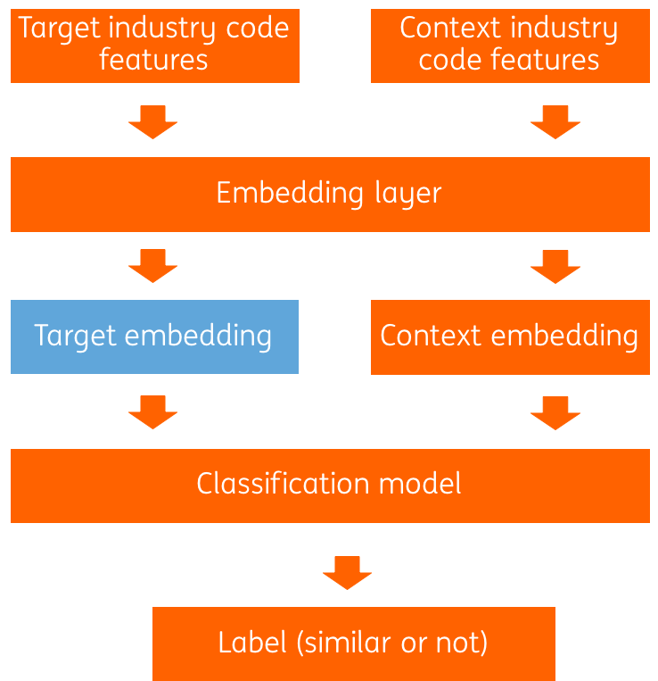

# Industry2vec
We provide an implementation for learning industry code vector representation and a dataset of industry vector.
It is developed by ING Wholesale Banking Advanced Analytics. This blog post (https://medium.com/wbaa/industry2vec-an-implementation-for-industry-code-vector-representation-68ec5f5de9a4) gives more details about implementation.

## Pre-trained industry vector
- `output/industry2vec.txt`: use company structure and industry code text description to generate industry code embedding

### Format of the industry2vec file
First column is the NAICS code. The rest columns are embedding vector

```
1111 -1.6701041 -1.6180947 -0.07520151 -0.3235364 0.3684799 1.8683335 -1.375658 0.79450375
1112 -2.3226075 -1.450457 -0.23238486 -0.17066789 0.42838484 2.179898 -1.0889027 0.54146314
1113 -1.7367148 -1.4358461 -0.13881683 -0.4271707 0.093370974 2.312091 -0.9790166 0.5508713
```

## Model
We use a Siamese network architecture to generate a vector numerical representation of the industry code. [Here](???) is a blog post to describe how we implement the model.
<p align="center">

</p>

## Folder structure
- data: input data folder, such as NAICS code description file, company structure file
- src: main python files
- experiment: jupyter notebook files which demonstrate how to get and visualize industry2vec.
  - `ing_model_experiment.ipynb` is how we built the industry vector representation. It requires company structure data, which is not in this repository due to data protection reason. You can build your company structure data by following the [blog post](???)
  - `non_ing_model_experiment.ipynb` is an alternative version of industry vector representation. It only use the industry code text description, so it can be reproduced easily.
- output: industry embedding vectors

## What is industry code
Industry code is a type of economic taxonomy that organizes companies into industrial groupings based on similar production processes, similar products, or similar behavior in financial markets. https://en.wikipedia.org/wiki/Industry_classification
There are several popular taxonomies, such as the North American Industry Classification System (NAICS), the Standard Industrial Classification (SIC) and the Standaard Bedrijfsindeling (SBI). In ING Bank, the NAICS and SBI codes are used. https://en.wikipedia.org/wiki/ North_American_Industry_Classification_System

You can download NAICS code description [here] (https://www.census.gov/eos/www/naics/2017NAICS/2017_NAICS_Structure.xlsx)


## Why we need industry2vec
We use the industry code as a feature in a number of data scientific models that we develop. The Peer Detection model for example searches in millions of companies for ones similar to the one given. Industry code is an important feature in the similarity calculation. Or the Holding Company Classification model assigns an industry to a financial holding based on the company tree structure. A holding company usually does not produce goods or services itself, rather its purpose is to own shares of subsidiaries. An example is the holding company Air France-KLM, which owns airlines KLM and Air France. The classification model naturally uses the industry codes of the subsidiaries to classify Air France-KLM as an airline.

In machine learning we could use the industry code directly as a categorical feature. There are however some disadvantages. There are around two thousand industry codes. If we one-hot encode them, the feature space becomes quite large. In addition any relations among codes, like 4841 General Freight Trucking and 4842 Specialized Freight Trucking, will be lost. By embedding, i.e. representing the industries of companies as vectors, we can keep the feature dimensionality low and we may keep relations between industries.

Industry2vec can detect similarity from text description and company structure even though the industry codes are not similar. Below is an example to find the nearest neighbor of NAICS code "Automobile dealers". The 3rd closest NAICS code "Automotive Repair and Maintenance" (8111) has similar description, although the NAICS code is very different.

```
NAICS	Distance	Description
4411	0.000000	Automobile Dealers
4412	0.960577	Other Motor Vehicle Dealers
4231	1.692941	Motor Vehicle and Motor Vehicle Parts and Supp...
8111	1.698621	Automotive Repair and Maintenance
5321	1.857971	Automotive Equipment Rental and Leasing
4451	1.921574	Grocery Stores
5313	1.959386	Activities Related to Real Estate
5311	2.125843	Lessors of Real Estate
4471	2.142971	Gasoline Stations
5312	2.183306	Offices of Real Estate Agents and Brokers
```

## Dependency
- GLOVE word embedding vector [glove.840B.300d.zip] (http://nlp.stanford.edu/data/wordvecs/glove.6B.zip)

## License
All work contained in this package is licensed under the Apache License, Version 2.0. See the include LICENSE file.

